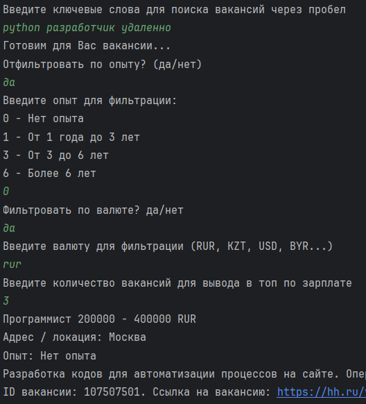
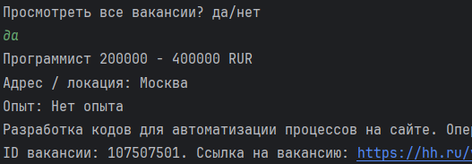

# Приложение для поиска вакансий (HeadHunter.ru)

Консольное приложение для поиска вакансий с сервиса HeadHunter.ru.
Предоставляет возможность отфильтровать и отсортировать вакансии по
различным критериям.

## Содержание
- Установка
- Использование
- Пример работы
- Структура
- Тестирование
- Документация и ссылки

## Установка
Клонирование репозитория на локальный репозиторий:
1. Чтобы клонировать репозиторий с GitHub себе на компьютер, необходимо
получить ссылку на доступ к репозиторию в разделе **Code** на странице
репозитория, выбрать способ взаимодействия с GitHub (**HTTPS**) и **скопировать**
ссылку на репозиторий для клонирования.
2. В главном меню **PyCharm** перейдите в меню **Get from VCS**. 
3. Вставьте ссылку на репозиторий и нажмите на кнопку **Clone**.
4. По окончании клонирования будет открыт проект, вы можете работать с этим проектом.

## Использование
Чтобы запустить консольное приложение, перейдите в модуль `main.py` в корне
проекта и запустите его. Программа будет запрашивать данные для поиска
вакансий по ключевым словам на сервисе hh.ru и параметры для фильтрации
и сортировки вакансий.

Данные с основной информацией по вакансиям выводятся в консоль в удобном читаемом
формате, а также содержат ссылки, которые легко скопировать и изучить текущую
вакансиюна сайте hh.ru.

## Пример работы приложения

## Структура
- **main.py** - модуль, реализующий основную логику проекта и взаимодействие
с пользователем, связывает функциональности проекта.
- **config.py** - модуль с путями к основным папкам и директориям.
- **external_api.py** - модуль с абстактными классами по работе с API.
- **hh_api.py** - модуль с классом работы с API hh.ru
- **file_worker.py** - модуль для чтения, перезаписи и добавления данных в файл
- **utils.py** - модуль с дополнительными функциями
- **vacancies.py** - модуль для создания и обработки объектов вакансий

## Тестирование
Тесты с реализованным функциям находятся в директории tests. Вы можете выполнить
проверку, запустив фреймворк pytest и запустив инструмент Code coverage с
помощью команд:

`pytest --cov` — при активированном виртуальном окружении.

`poetry run pytest --cov` — через poetry.

## Документация и ссылки
Документация hh.ru: https://api.hh.ru/openapi/redoc
